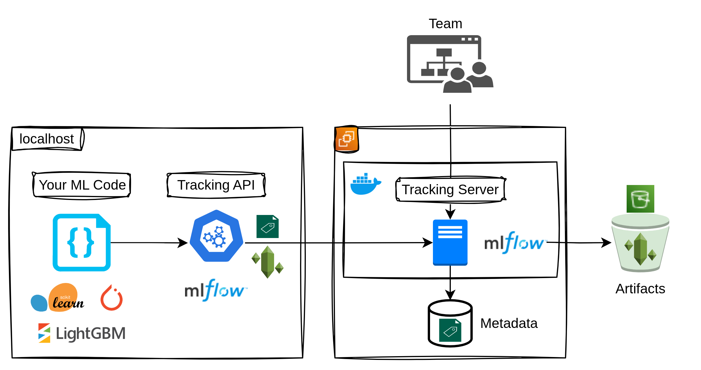

# MLOps Environment

MLflow と Prefect を使用した機械学習オペレーション環境です。

## 構成

- **MLflow**: 機械学習実験管理・モデル管理



- **Prefect**: ワークフロー管理・データパイプライン

## 使用方法

### 全サービス起動
```bash
make up
```

### 全サービス停止
```bash
make down
```

### ログ確認
```bash
make logs
```

### サービス状態確認
```bash
make ps
```

### 個別サービス操作
```bash
# MLflow
make mlflow-up
make mlflow-down
make mlflow-logs

# Prefect
make prefect-up
make prefect-down
make prefect-logs
```

### アクセス情報

- **MLflow UI**: http://localhost:5000
- **Prefect UI**: http://localhost:4200

## 利用可能なコマンド

すべてのコマンドは `make help` で確認できます。
